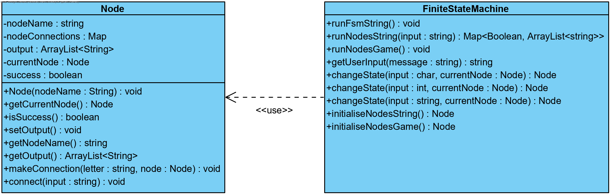

# FSM
This is an assigment for school. 

The assignment was to make a finite state machine which can both read A's and B's (string based), and change states accordingly. It was also a requirement to make a self-designed finite state machine, for which I chose to make a (very) simple game. The final requirement was to write unit tests for the final state machine. These can be found in the test folder.

Here is the UML of the Finite state machine:

For the logic of the string based FSM a state diagram was provided by the school.

For the logic of the "game" FSM the following state diagram was used:

